# NutriShare iOS

NutriShare의 iOS 프로젝트입니다.  
SwiftUI 기반으로 구성되어 있고, 로컬 백엔드와 연동해 홈, 공동구매, 장바구니, 마이페이지 화면을 테스트할 수 있습니다.

---

## 스크린샷

### 홈 & 상품 상세

| 홈 | 상품 상세 |
|:---:|:---:|
| 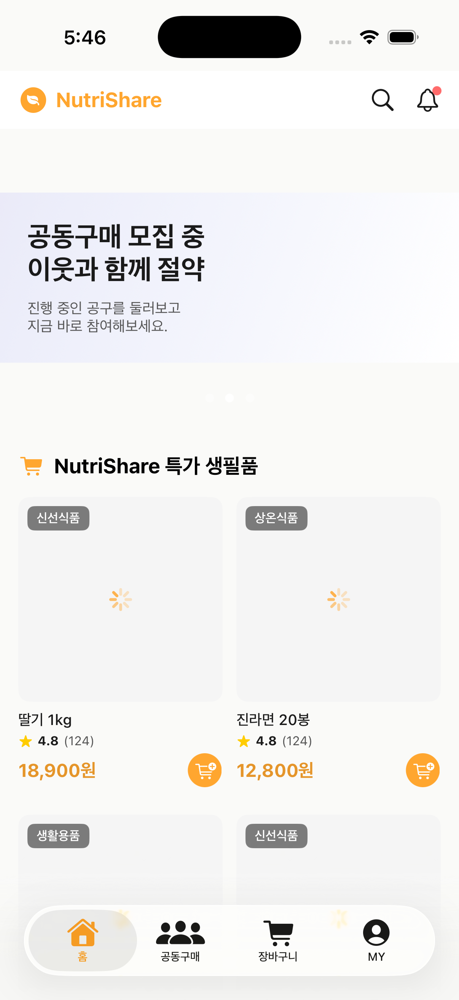 | 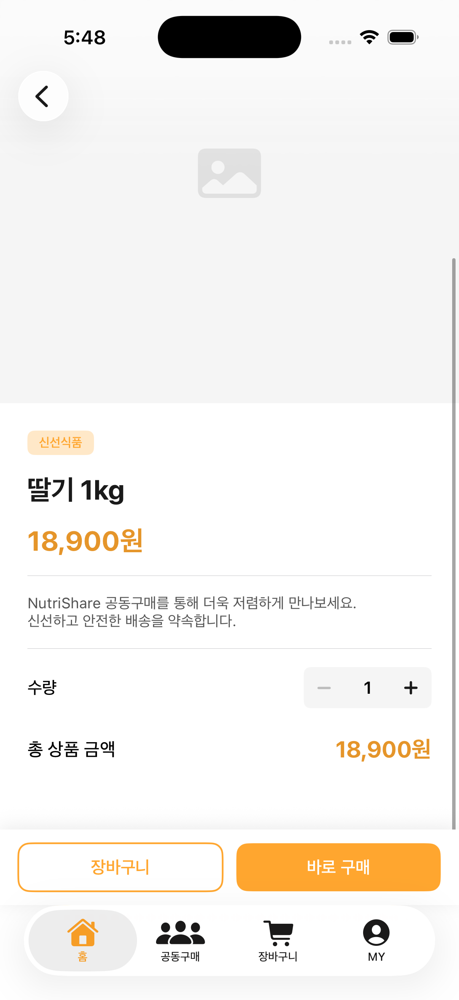 |
 
### 공동구매
 
| 공동구매 목록 | 공동구매 열기 (상품 선택) | 공동구매 열기 (조건 설정) |
|:---:|:---:|:---:|
| 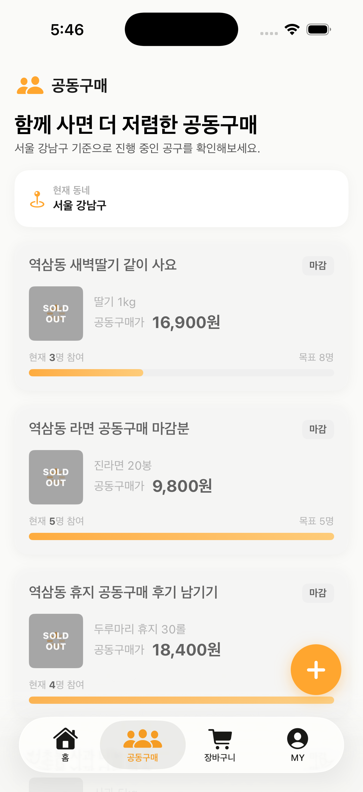 | 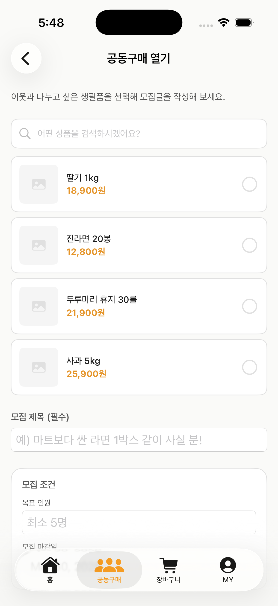 | 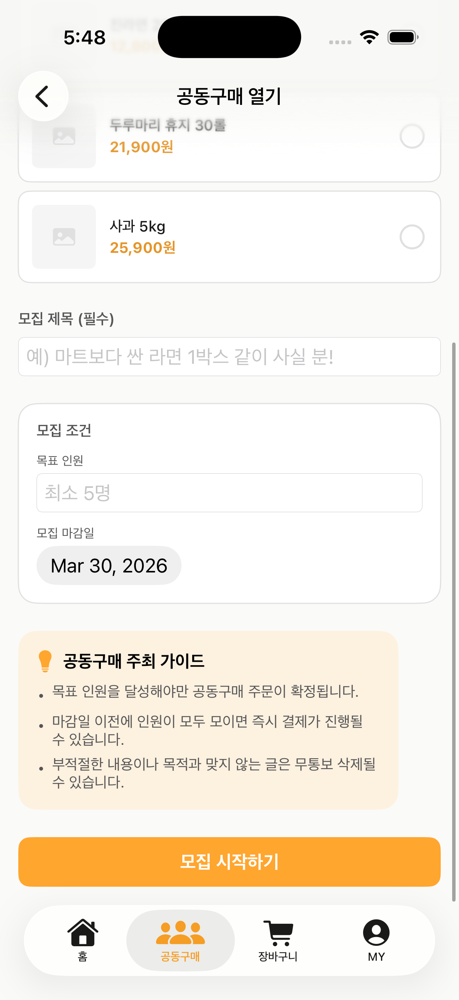 |
 
### 장바구니 & 주문
 
| 장바구니 | 주문 |
|:---:|:---:|
| 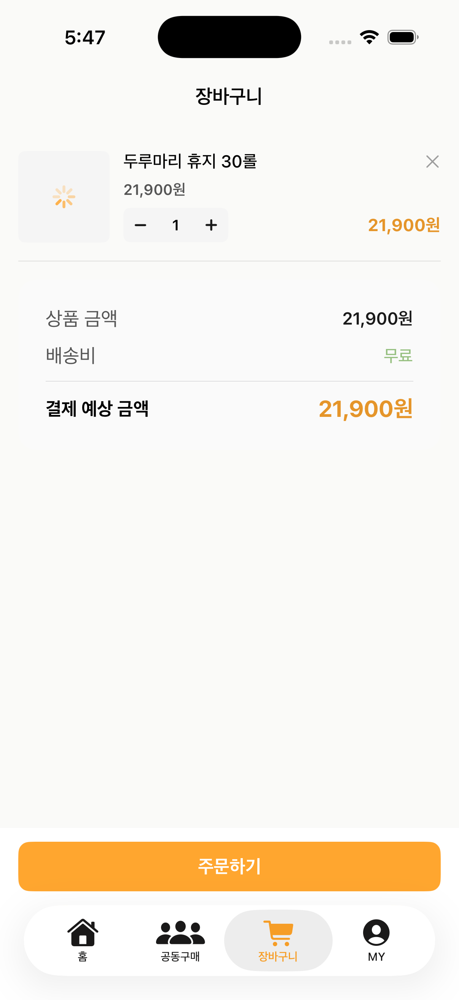 | 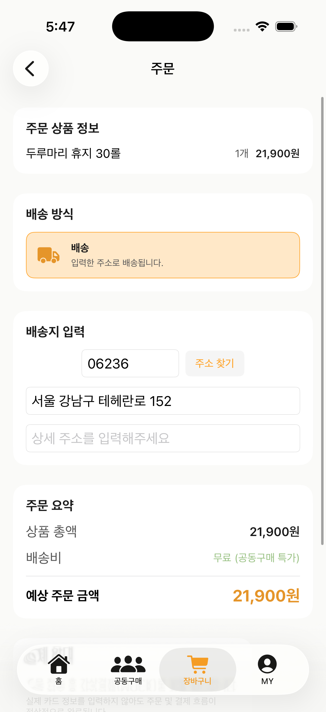 |
 
### 마이페이지
 
| MY | 주문 내역 | 리뷰 | 참여공구 |
|:---:|:---:|:---:|:---:|
| 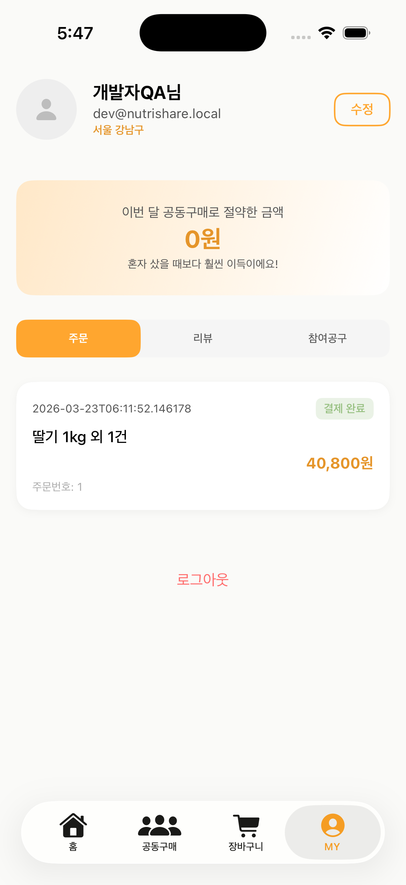 |  | 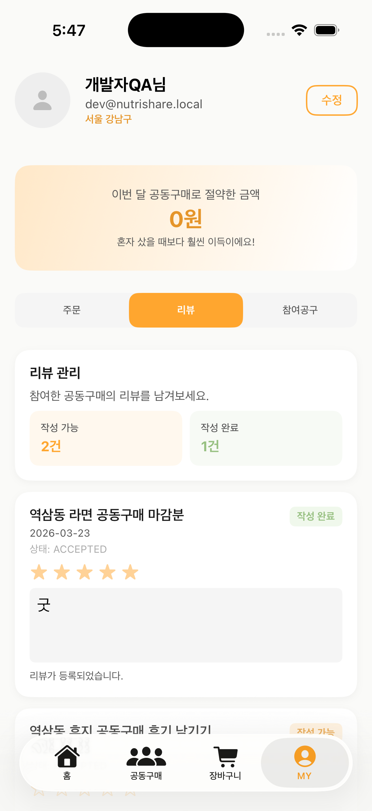 | 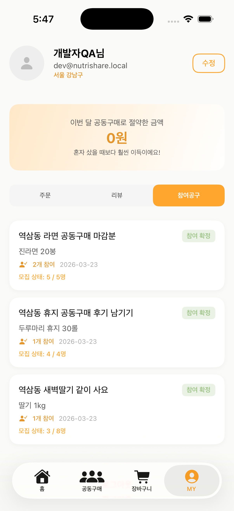 |
 
### 알림 & 프로필 수정
 
| 알림 | 프로필 수정 |
|:---:|:---:|
| 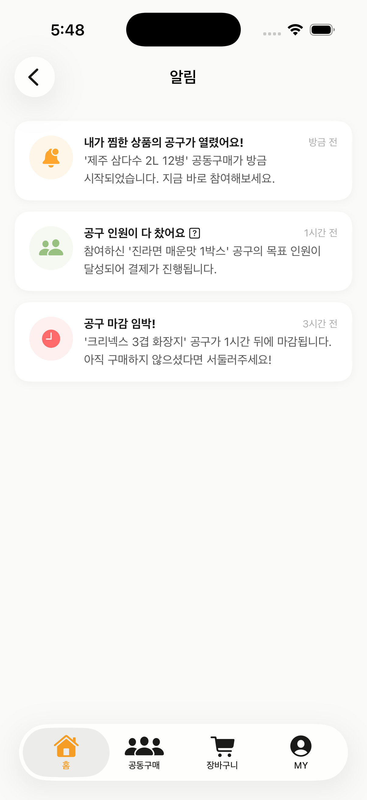 | 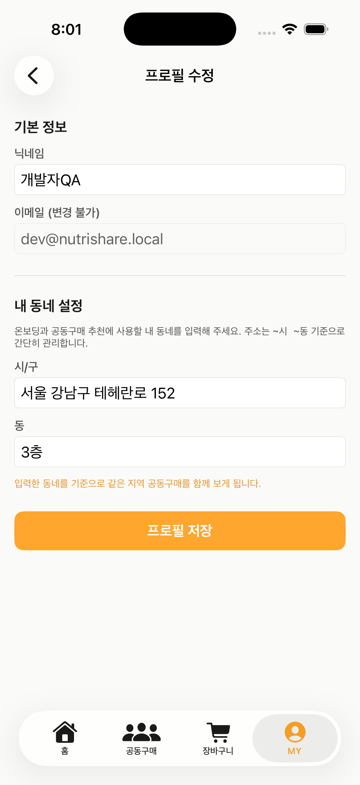 |

---

## Run

1. 백엔드를 먼저 실행합니다.  
   현재 기본 API Base URL은 `http://localhost:8080/api/v1` 입니다.

2. Xcode에서 아래 프로젝트를 엽니다.
   ```
   NutriShare.xcodeproj
   ```

3. 상단 툴바에서 iOS Simulator 를 선택한 뒤 실행합니다.  
   > "A build only device cannot be used to run this target" 오류가 뜨면 실제 기기 대신 시뮬레이터를 destination으로 선택해주세요.

---

## Project Structure

```
NutriShare/
├── Views/        # 화면 단위 SwiftUI 뷰
├── Models/       # API 응답 및 앱 모델
├── Services/     # 네트워크 및 인증 처리
└── Utils/        # 디자인 시스템 및 공용 유틸
```

